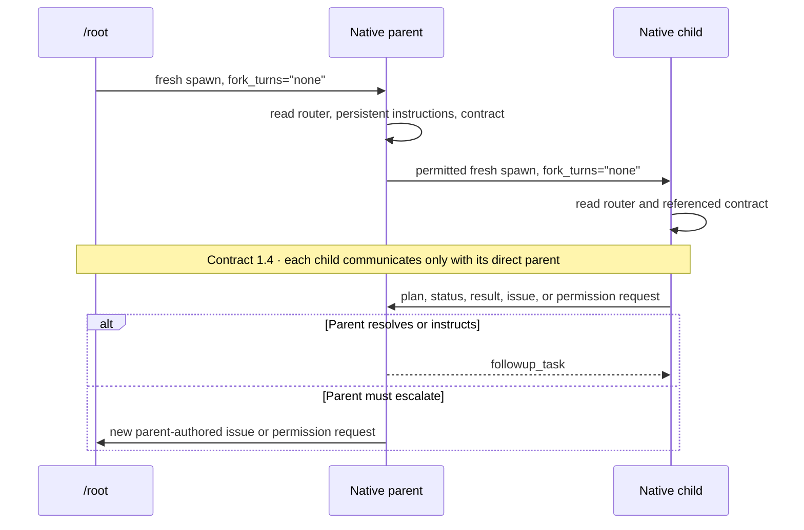

# Basix

Basix is a collection of reusable Codex skills, native read-only agents, shared
developer instructions, and installation tooling. This repository serves two
purposes: it is the source tree in which Basix is developed, and it is the bundle
from which Basix can be installed globally or into any Codex project.

> Upgrading from Defaultwienix requires a clean transition. Uninstall the old
> Defaultwienix installation with its original installer before installing Basix.
> Basix intentionally provides no legacy aliases or automatic migration.

## 1. Developing and extending Basix in this repository

### Repository layout

All installable Basix sources live below `src/`:

| Path | Purpose |
| --- | --- |
| `src/skills/` | Canonical reusable skills and their scripts, references, assets, and UI metadata |
| `src/agents/native/` | Canonical native Codex agent TOMLs |
| `src/setup/` | Global, project, Lumen, and Tor-only Scrapling installers |
| `src/scripts/` | Launchers shared across skills or agents |
| `src/docs/` | Architecture and component documentation |
| `src/tests/` | Basix bundle verification and setup tests |
| `test/` | Repository-level tests, including the Scrapling installer and policy tests |

The source of truth for agent behavior is `src/agents/native/`; setup scripts only
bind those definitions into supported Codex locations. Persistent shared
instructions come from `src/setup/developer_instruction.md`. Installer state is
used to ensure that uninstall operations preserve foreign or locally modified
  files. Copy state inventories every installed file, so uninstall can remove
unchanged Basix files from a mixed tree without deleting changed files, foreign
siblings, symlinks, special files, or nonempty parent directories. Configuration
markers define the Basix-owned spans; content outside them remains byte-for-byte
unchanged.

### Making changes

- Add a focused workflow under `src/skills/<name>/SKILL.md`; keep its supporting
  scripts and references inside that skill directory.
- Change native agents only in `src/agents/native/`. The `basix` router owns the
  runtime communication contract; `basix-agent-authoring` owns the native
  bootstrap, JSON Schema, and validator tooling.
- Put only genuinely shared launchers in `src/scripts/`.
- Keep installers idempotent, preserve user-modified files, and support
  non-mutating `--dry-run` behavior where exposed.
- Update the relevant documentation whenever an installable interface changes.

More detail is available in the [architecture](src/docs/architecture.md),
[agent](src/docs/agents.md), and [skill](src/docs/skills.md) documentation.

### Verification

From the repository root, run:

```bash
./src/tests/verify-basix.sh
./src/tests/test-setup.sh
bash test/test-installer.sh
bash test/test-codex-integration.sh
PYTHONPATH=src/scripts python3 test/test_system_cavify.py
```

The live discovery check is intentionally separate because it performs one real
model turn and therefore requires Codex authentication, network access, and
available usage quota:

```bash
bash test/test-codex-discovery.sh
```

For changes to shell scripts, also run ShellCheck when it is installed:

```bash
shellcheck src/setup/*.sh src/setup/scrapling-tor/*.sh test/*.sh
git diff --check
```

`verify-basix.sh` includes static metadata, agent, Python, shell, and real Codex
plugin compatibility checks where the required programs are available.

## 2. Installing and using Basix in Codex projects

### Requirements

- Linux or another environment capable of running the Bash installers
- Python 3.11 or newer
- A current Codex CLI
- Git when installing the optional Ory Lumen integration separately
- Podman or Docker only when installing the optional Tor-only Scrapling MCP

Run all commands below from a Basix repository checkout. Both installers always
copy complete skill trees and the complete private native-agent directory. They
never create symlinks. Native agents are registered with managed `[agents.<name>]`
`config_file` entries instead of being written into shared agent directories.
In global plugin mode, generated metadata is copied as well. On reinstall,
recorded copies synchronize with `src`; obsolete unchanged managed files are
removed. Foreign directories, directory symlinks, and physical source aliases
are rejected before mutation. Uninstall is intentionally conservative: it removes only state-
and hash-confirmed Basix content, including unchanged files inside otherwise
mixed copy trees, and keeps locally modified or foreign targets.

### Option A: Install Basix globally

Use global installation when Basix should be available to all Codex projects for
the current user:

```bash
./src/setup/install_as_plugin.sh
```

This creates an independent plugin bundle at `$CODEX_HOME/basix-plugin-root/`,
registers it as the local Codex marketplace `basix-local`, installs the Basix
plugin, stores native agents under `$CODEX_HOME/basix/agents/`, registers their
absolute `config_file` paths, and merges the marked Basix instruction block into
`$CODEX_HOME/config.toml`. It never writes Basix agents into the shared
`$CODEX_HOME/agents/` directory.

Common variants:

```bash
# Preview without changing files or Codex configuration
./src/setup/install_as_plugin.sh --dry-run

# Remove installer-managed Basix state, preserving local changes
./src/setup/install_as_plugin.sh --uninstall
```

### Option B: Install Basix into one Codex project

Use project installation when Basix should be committed to or isolated within a
specific project:

```bash
cd /path/to/project
/path/to/basix/src/setup/install_for_project.sh
```

The installer copies complete skill directories under
`.agents/skills/`, stores native agents privately under `.codex/basix/agents/`,
and registers them with managed `[agents.<name>].config_file` entries in
`.codex/config.toml`. It never writes Basix TOMLs into the shared
`.codex/agents/` directory and never creates or manages project `.basix`; that
directory is reserved for project-owned memory and credential files. Only load
project-level Codex configuration from projects you trust.

Useful variants:

```bash
# Preview changes to the current project
/path/to/basix/src/setup/install_for_project.sh --dry-run

# Remove installer-managed project files, preserving local changes
/path/to/basix/src/setup/install_for_project.sh --uninstall

# Alternatively, target a project explicitly from any directory
./src/setup/install_for_project.sh /path/to/project
```

Foreign parents, directories, symlinks, and canonical sources remain protected.
See the full [installation reference](src/docs/installation.md).

### Optional: Ory Lumen semantic search

The Basix installers never install or invoke Lumen. Install it explicitly when
semantic search is wanted:

```bash
./src/setup/install_ory_lumen.sh
```

Run indexing separately afterward. The configured embedding backend and
model—normally provided by Ollama—must be available.

### Optional: Tor-only Scrapling MCP

Install the managed Scrapling MCP when Basix agents should have web-fetching tools
whose container egress is restricted to Tor:

```bash
./src/setup/install-scrapling-codex.sh --dry-run
./src/setup/install-scrapling-codex.sh
```

The installer permits exactly one detected Scrapling registration and always uses
the canonical MCP name `scrapling`. If one older or third-party registration is
found, approve its replacement interactively or use `--force` for the same
noninteractive confirmation:

```bash
./src/setup/install-scrapling-codex.sh --force
```

Two or more registrations, foreign running Scrapling MCP processes, or unsafe
runtime resources always cause an abort; `--force` cannot bypass those checks.
The installer pulls the configured Scrapling image, pins the verified digest,
validates the exact MCP tool policy, and registers a hardened launcher only after
Tor egress succeeds. Restart running Codex sessions after a successful migration.

This provides a Tor-only guarantee at the container network boundary. It does
**not** turn Chromium into Tor Browser or reproduce Tor Browser's fingerprinting
protections. Administrators controlling the container daemon, host networking, or
root access remain outside this security boundary.

### Using Basix after installation

Restart Codex after installation so newly installed skills, agents, MCP servers,
and persistent instructions are loaded. Basix then supplies:

- mandatory routing of all external research, website inspection, and scraping to
  `basix_researcher`, which uses Scrapling for web tasks and reports a blocker if
  that capability is unavailable;
- cost-aware routing that keeps tightly bounded, compact work with Root and sends
  broad evidence ingestion, multi-step work, specialized work, or assignments
  expected to need more than two substantive domain-tool calls to a Basix agent;
- automatic Conventional Commits for Root's task changes in Git repositories, but
  only after every running verification and test completes successfully;
- agent-owned persistent memory in `.basix/memory.toml`, read once at session start
  and after each context compaction, actively applied to reduce work and prevent
  repeated mistakes, and autonomously curated without user approval at natural
  work checkpoints; concise dated insights use fixed English categories and are
  committed with task changes unless `.basix` is ignored, while useful, strongly
  evidenced subagent proposals retain their originating role;
- mandatory routing of extensive local evidence discovery to
  `basix_file_explorer`, preferably before discovery begins, while implementation
  and final code analysis remain with Root;
- the `basix-agent-authoring` skill for creating and validating native agents;
- the writable `basix_pager` for one Root-authorized nontrivial web assignment, selected
  with exactly one profile (`ui_ux`, `frontend`, `backend_web`, `fullstack`, or
  `integration`), while explorer and researcher agents remain read-only;
- the read-only `basix_verifier` for one fresh-context, immutable-result review;
  it fingerprints the target, reports evidence-backed verdicts, and requires a
  fresh verifier for drift, remediation, changed criteria, or expanded scope;
- Lumen semantic project search when the optional integration is installed and
  the project has been indexed.

### Agent communication contract



The router-owned Contract 1.4 is the sole source for message envelopes, cycles,
status cadence, issues, permissions, reports, continuations, waiting, and visible
confirmations. Every child sends only to its direct spawning parent. That parent
resolves the report, instructs the child, or authors a new escalation in its own
task cycle to its own parent; child messages are never forwarded automatically.
Developer instructions and the router define only role selection, fresh spawning,
assignment boundaries, and mandatory contract loading. Native TOMLs contain only
the validated bootstrap plus role-specific behavior.

### Coordinating pager work

Root starts every pager with `fork_turns="none"`, a unique never-reused task
name, one profile, concrete file/module ownership, acceptance gates, and exact
verification commands. The full assignment also states user impact,
authoritative requirements, allowed ownership extensions, non-goals, known
worktree changes, required skills, allowed delegations, and any contract
revision. A pager reports scope or ownership changes before editing shared
files and follows the communication contract for review, fixes, and terminal results.

For dependent frontend/backend chains, Root owns the target project's
`.basix/contracts/<chain-id>.md`; pagers update only their assigned sections,
ledger entries, and proposals. Use sequential fresh pagers by default. Safe
parallel work requires a frozen interface, disjoint ownership, separate
contract sections, no shared generated outputs, and a planned Root integration
step. Review handoffs, fixes, terminal results, and continuations follow Contract 1.4.

### Coordinating verification

Start `basix_verifier` with `fork_turns="none"`, a unique task name, a complete
assignment, and a mutation-free verification window. Include the original
requirements, worker report, owned targets, known pre-existing changes, allowed
checks, and constraints. Contract 1.4 governs its messages and continuation cycle;
target drift, remediation validation, changed acceptance criteria, or a new result
always gets a fresh verifier.

Invoke the relevant skill or agent naturally in Codex, or mention Basix when the
task concerns maintaining its installable standards and structure.
